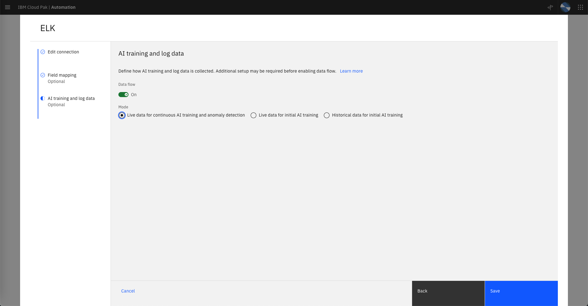

## Configure Log Anomaly Inference

After your trained model is successfully deployed, update your Log Ops integration, such as ELK to start log anomaly detection:

* Choose `Live data for continuous AI training and anomaly detection` as the option for training mode.

* Enable `Data flow`.

   

---

## Data flow

when your trained AI models are deployed, data flows through the `cp4waiops-cartridge-windowed-logs-1000-1000` topic. Any detected anomalies, such as log anomalies, Netcool Operations Insights events, flow through the `cp4waiops-cartridge.lifecycle.input.events` topic. The Event Grouping Service then consumes and groups the events from the `cp4waiops-cartridge.lifecycle.input.events` topic, and resolves the entities by using the Topology Service. The service gets the localization and blast radius from the localization and blast radius service, and finally produces stories to the `cp4waiops-cartridge.lifecycle.input.stories` topic. These stories are eventually surfaced as notifications on the reactive Slack channel.

---

# Verify Incident Story

< TBD > 

