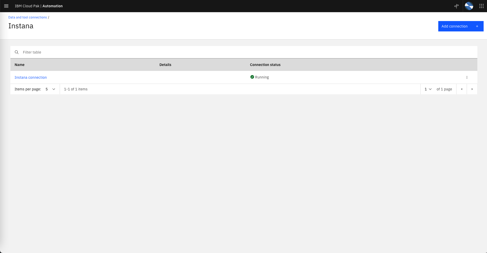

# Configuring Data Sources

## Connecting to the CP4WAIOps console

To run this Lab, make sure that you use the Chrome or Firefox browser and that the language in your browser settings is set to *English*. 
Lets start by connecting to the CP4WAIOps console. Use the URL and login credentials given by your Lab coordinator. You will see the console Home page as shown below. 

* Note that the Lab environments use self signed certificates. During login the browser will ask you to accept the risk. You will probably get two prompts to accept the risk. 

* On the login page, select **IBM provided credentials (admin only)**.

* As you go to different new pages in the environment, you will see the *Page Tour* pop-up.  Feel free to follow them.


---

## Configure the EFK Integration

EFK is a variant of ELK (Elasticsearch, Logstash, and Kibana). EFK is a suite of tools combining Elasticsearch, Fluentd, and Kibana that functions as an application log aggregation tool. Note that Kibana is a data visualization and exploration tool used for log and time-series analytics, application monitoring, and operational intelligence use cases. Now, to simplify the installation and configuration effort for installing the different components of the EFK stack on OpenShift, we leverage the `OpenShift Logging` library from OpenShift. OpenShift customers that prefer not to spend part of their budget on a commercial log aggregator such as Humio, Splunk, or LogDNA, more than likely use the `OpenShift Logging` library that comes out of the box. 

To have the CP4WAIOps collect logs from the EFK installation that leverages the `OpenShift Logging` library, you need to define an EFK integration. The lab will provide the values that you should use for defining the EFK integration. 

**Note that we will configure this connection but we will leave the data flow disabled because historical log training data has already been loaded to speed up the Lab. We will enable the data flow later in the Lab during the final Log Anomaly Inference section**

From the Home page, under `Overview` clik on `Data and tool connections` on the left side of the page. Click on the `Add connection` button on the top right. On the ELK card, select `Add connection`. Take a moment to read the connection overview on the right side slider, then click on `Connect`, as shown in the following screen.


Complete the ELK, `Add connection` form, with the following values:

* `Name`: Name of the ELK integration, for example `EFK for QOTD`.

* `Description`: Leave it blank.

* `ELK service URL`: Get the service URL for the EFK installation from the *Lab Parameters Table*. Make sure to include the last * character at the end.

* `Kibana URL`: Get URL for Kibana from the *Lab Parameters Table*.

* `Authentication type`: Set this value to `Token`.

* `Token`: Get the token from the *Lab Parameters Table*.

* `Certificate`: Leave it blank.

* `Filters`: Don't change it.

* `Time zone`: Select `GMT-4`.

* `Kibana port`: Type `443`.

* `Base parallelism`: Don't change it.

* `Sampling rate`: Don't change it.

* `JSON processing option`: Don't change it.

* Click on the `Test connection` button and confirm you get *Test succeeded* 

Click on the `Next` button.

* `Field mapping`: Use the mapping shown below instead of the default mapping provided on the ELK integration. Make sure you see the *Valid JSON configuration* message after that:

```
{
    "codec": "elk",
    "message_field": "message",
    "log_entity_types": "kubernetes.container_image_id, kubernetes.host, kubernetes.pod_name, kubernetes.namespace_name",
    "instance_id_field": "kubernetes.container_name",
    "rolling_time": 10,
    "timestamp_field": "@timestamp"
}
```


Click on the `Next` button.


* `Data flow`: we will leave this Off (grey) as the historical log data has already been loaded to speed up the Lab. We will enable the data flow later in the Lab during the final Log Anomaly Inference section

* `Mode`: Select the `Historical data for initial AI training` option using the dates listed below. CP4WAIOps will ingest one day of historical application log data (stored in the log aggregator) that we know in advance that can be used as a "reference" for a normal day because no major IT Operations incident happen during that day. We will use this data later for Log Anomaly training. 

    * Start date: May 8, 2022
    * End Date: May 8, 2022

* `Source parallelism (1-50)`: Don't change it.  

* Click on `Done`.

The following screenshots show the form update flow as guidance **(note that config values may be different in the screenshots, follow the instructions instead)**


After some time, you would see the message `Connection completed. IBM Cloud Pak for Watson AIOps has successfully processed your request` as shown below.


---

## Configure the Instana Integration

The CP4WAIOps will also consume topology information from Instana therefore we will configure this integration.

Lets verify first that there is no topology data in the system. From the navigator menu, go to the Home page again, clik on `Resource management` under `Overview` on the left side of the page. On the Resource management page, make sure there are no Applications, Resource groups nor Resources defined, as shown below
 


Now, lets define the Instana integration. From the Home page, clik on `Data and tool connections` under `Overview` on the left side of the page. Click on the `Add connection` button on the top right. On the Instana card, select `Add connection`. Take a moment to read the connection overview on the right side slider, then click on `Connect`, as shown in the following screen.


Enter the following `Add connection` information:

* `Name`: The display name of your connection, for example `Instana connection`.

* `Description`: An optional description for the connection. Leave it blank.

* `Endpoint`: Get the URL for the Instana Endpoint from the *Lab Parameters Table*.

* `API Token`: Get the API Token from the *Lab Parameters Table*.

* `Deployment options`: Select `local` (Note that it is possible to deploy an Instana conection gateway remotely, but in this lab we will deploy in the same `local` cluster).


Click Next.

Enter the following `Collect topology data`:

* `Enable data flow`: Set this toggle button to on (green).

* `Time window` (seconds): Leave as it is. This is the windowSize parameter within the Instana API.

* `Connection Intervals` (seconds): Leave as it is. This is how frequently to run the job to collect topology.

* `Application name allowlist pattern`: This allows to select from the set of applications that Instana is "observing" which one we will pull data from. In this Lab, we will pull topology data from a single application called qotd. Type in `qotd`.

* `Import Instana application perspectives as Cloud Pak for Watson AIOps applications`: Make sure this toggle button is set to `on` (green). This option will save us some time as we don't need to manually create in CP4WAIOps an application that group the topology resources that we pull from Instana. In CP4WAIOps, an application represents a group of resources put together.


Click Next.

Enter the following in `Collect event data`:

* `Enable data flow`: Slide this toggle button to off (grey). We will not collect event data in this Lab.

Click Next.

Enter the following in `Collect metric data`:

* `Enable data flow`: Slide this toggle button to off (grey). We will not collect metric data in this Lab.

Click Done. 

Now, you will see the Instana connection created with the connection status as *Not running*.


After around 30 seconds, you will see that the Instana connection change the connection status to *Running* as shown below.



Now, lets verify that the CP4WAIOps is actually receiving topology data.

From the Home page, clik on Resource management under Overview on the left side of the page. On the Resource management page, you will see a new application defined called `qotd` as shown below:


Click on the application `qotd` and you will see the topology resources related to this application as shown in the picture below. Feel free to zoom-in to see details. Note that it will take 10-20 minutes to get a complete representation of all the topology entities and relationships.


---

## Exploring Automations in CP4WAIOps

By creating automations in CP4WAIOps, you can proactively set up **policies**, **runbooks**, and **actions** to detect and remediate events, both current and future. Policies are rules that contain conditions and a set of actions that can be manual or automated. With policies, you can automatically group alerts into a story, and assign runbooks to resolve alerts.

When you create a runbook, you can define the required steps to resolve a situation. If you don’t have any runbooks, you can create a new one or load some sample runbooks. Actions in runbooks are the collection of several manual steps into a single automated entity. An action improves runbook efficiency by automatically performing procedures and operations. Actions can be shared and reused across runbooks.


### Review and Update CP4WAIOps Policies

Now, lets take a look at the automations page in CP4WAIOps. We will update a few of the existing policies that are needed for this Lab.

From the Home page, clik on `Automations` under `Overview` on the left side of the page and make sure you follow the page introduction tour (pop-up) as this will explain this page in detail.  In this page, we can manage *Policies*, *Runbooks* and *Actions*.

Under the *Policies* tab, we can see a list of system predefined policies that support a number of features in CP4WAIOps. We will review and enable a predefined policy that create stories:

* Click on the Tag pull down filter and select `Story` to only show the Story related policies.

* Change the state of the `DEMO Story creation policy for all alerts` policy from **Enabled** to **Disabled** by clicking on the State slider. We don't need this policy in this Lab.

* Change the state of the `Default story creation policy for all alerts` policy from **Disabled** to **Enabled** by clicking on the State slider. We need to enable this policy so we can see stories being created later in the Inference section of the Lab. This Policy will basically create a new Story for every new Alert regardless of the severity of the Alert. 

Click on the policy name to see the policy details on the right side of the page. 

* Click on the `Journal` tab to see the updates done so far to this policy.

* Click on the `Specification` tab to see the actual steps or logic of the policy. Note that the logic can be described as follows:

```
if ( Alert is created ) then
    create a Story regardless of the Alert severity
fi
```

That's all we need to do to enable this policy. 


### Exploring Runbooks

Use Runbook Automation to build and execute runbooks that can help IT staff to solve common operational problems. Runbook Automation can automate procedures that do not require human interaction, thereby increasing the efficiency of IT operations processes. Operators can spend more time innovating and are freed from performing time-consuming manual tasks.

* What problems does Runbook Automation address?

    IT systems keep growing in complexity. The number of events are increasing, and the pressure to move from finding problems to fixing them is increasing. Runbook Automation supports operational and expert teams in developing consistent and reliable procedures for daily operational tasks.

* How can I simplify daily operational tasks?

    Using Runbook Automation, as a first step, you can record standard manual activities, so that they are run consistently across the organization. The next step is to replace manual steps with script-based tasks.

* What is a runbook again?

    A runbook is a controlled set of automated and manual steps that support system and network operational processes. A runbook can orchestrate all types of infrastructure elements, such as applications, network components, or servers.

Runbook Automation helps users to define, build, orchestrate, and manage runbooks. A knowledge base can be built up over time through collaboration between Subject Matter Experts (SMEs) and operational staff.

Runbook Automation in CP4WAIOps supports three different types of runbooks:

* **Manual runbooks**: Steps describe the exact procedure that an operator must follow. The operator uses standard tools, which can be accessed from their working environment.

* **Semi-automated runbooks**: Each step describes exactly what an operator must do. Additionally, the operator can run an automated task on a target system.

* **Fully automated runbooks**: The runbook runs automatically without operator interaction.


### Exploring Actions

In runbooks, actions are the collection of several steps into a single automated entity. An action improves runbook efficiency by automatically performing procedures and operations. Runbook Automation supports actions of type script-SSH and HTTP. 


* **Script-SSH actions** - You can create an action of type script by leveraging an existing SSH connection. The Operating System of the endpoint system can be either UNIX® (including AIX® and Linux®) or Windows™. This action does not require an additional agent as it uses a direct remote execution connection through SSH.

* **HTTP actions** - The HTTP action allows you to send HTTP requests to a specified web service.

* **Ansible Tower actions** - The Ansible Tower actions leverage an existing Ansible Tower connection to harvests Ansible Tower type actions from the connected Ansible Tower server. These actions are created automatically and reference an existing asset from a connected Ansible Tower installation. Unlike script-SSH actions, Ansible Tower actions do not define new automation content inside the CP4WAIOps. Instead they point to an existing automation, present in the Ansible Tower server, which is a job or job workflow template. When an Ansible Tower Action runs, it calls the specific "launch" operation of that template on the connected Ansible Tower server. 


Lets explore some sample runbooks that have been preloaded for this Lab. From the Home page, clik on `Automations` under `Overview` on the left side of the page. Click on the `Runbooks` tab. We will review the `Restart RobotShop Ratings` runbook. Click on the three dots at the end of the row and select `Preview`.
You see that on the right panel under Information the Type is Automatic. This makes sense because this runbook consists of two Actions. 
The first Action stops the ratings service of the sample Robotshop application. The second Action, starts this service again. Click on the `More Info` button of both actions. You will see that the type of both actions is `Ansible Tower`. This means that there is an Ansible playbook for each of these actions and these playbooks run from an Ansible Tower server.

---