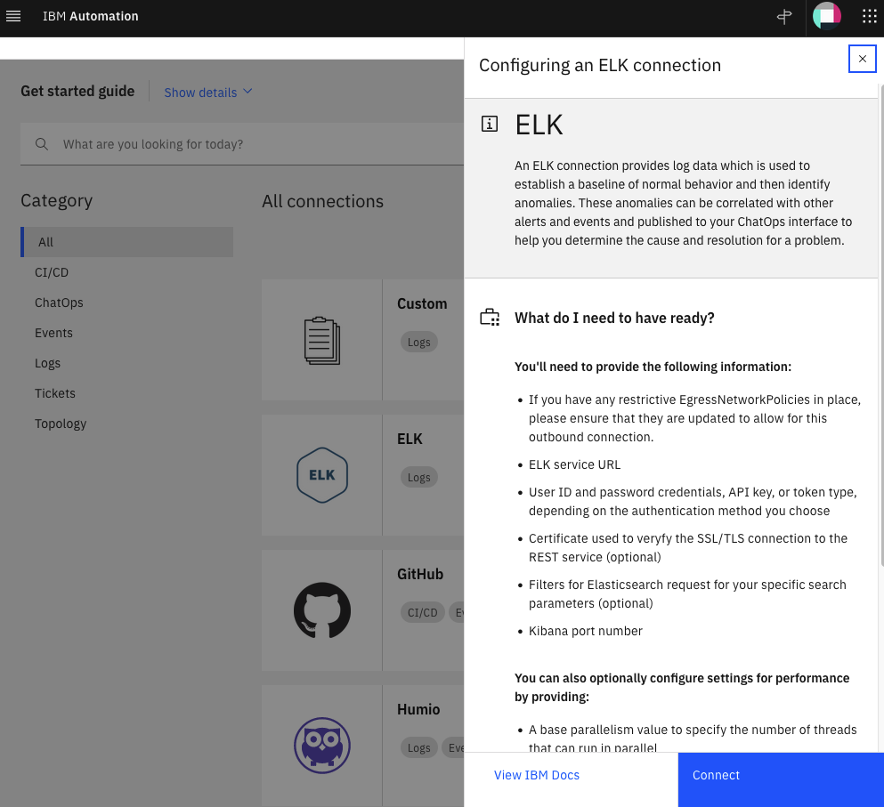
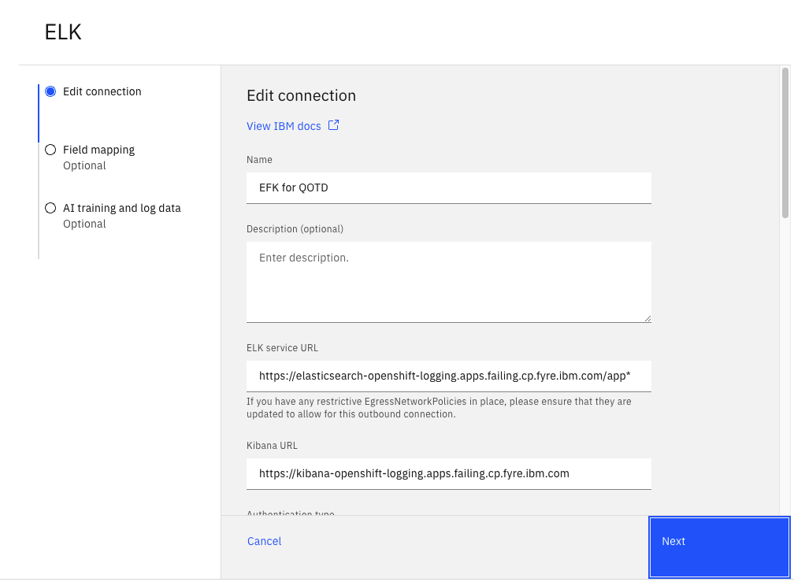
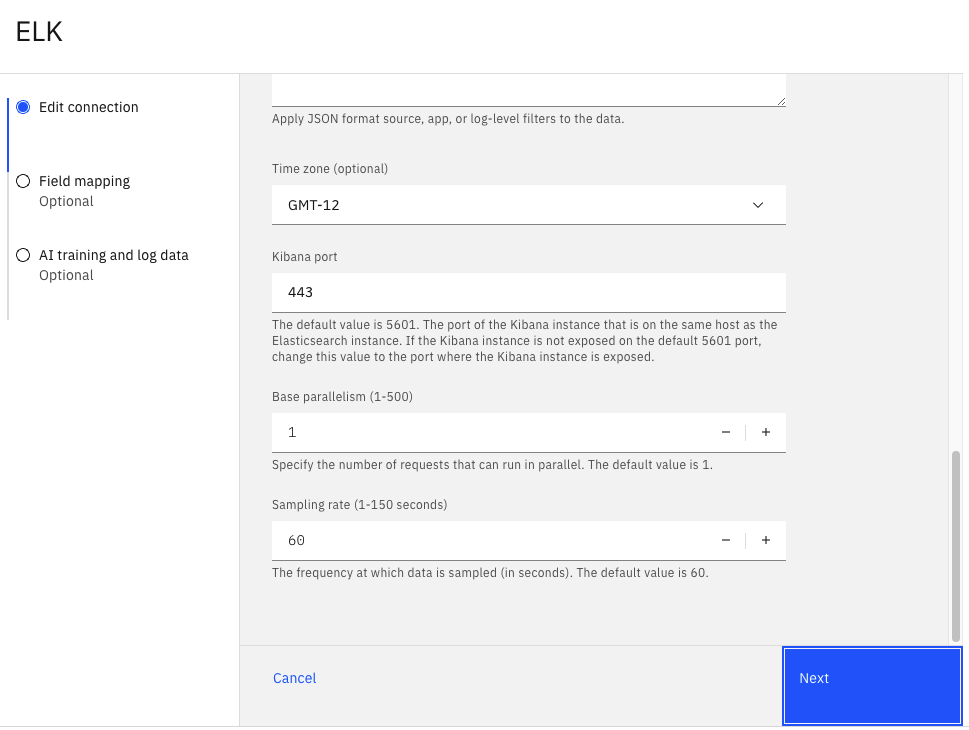
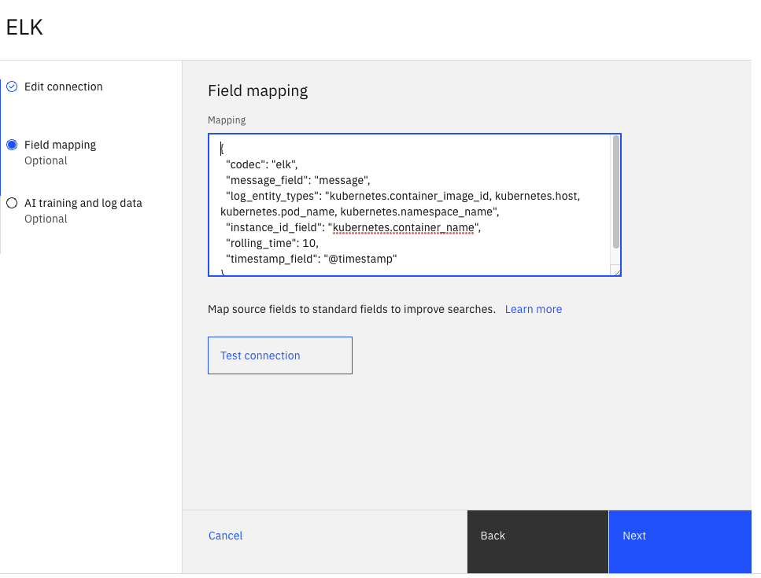
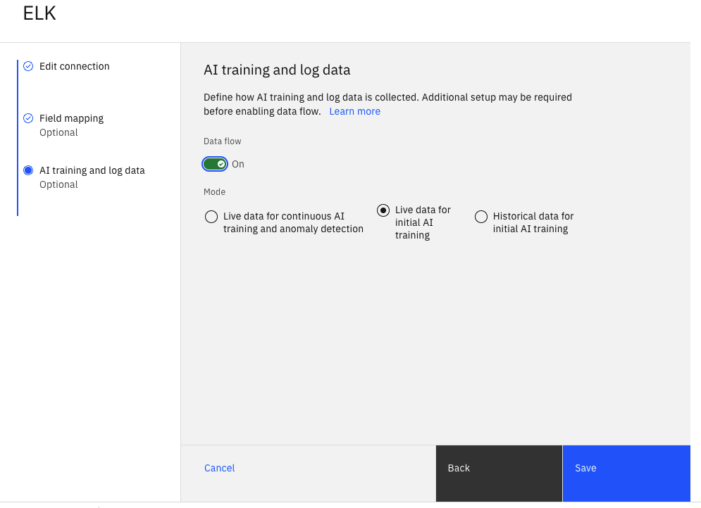

# Welcome to the Watson AIOps v3.3 Lab

For full product documentation visit [here](https://www.ibm.com/docs/en/cloud-paks/cloud-pak-watson-aiops/3.3.1).

## Define EFK Integration

EFK is a variant of ELK (Elasticsearch, Logstash, and Kibana). EFK is a suite of tools combining Elasticsearch, Fluentd, and Kibana that functions as a log aggregation tool. To simplify the installation and configuration effort for installing the different components of the EFK stack on OpenShift, we leverage the `OpenShift Logging` library from OpenShift. OpenShift customers that prefer not to spend part of their budget on a commercial log aggregator such as Humio, Splunk, or LogDNA, more than likely use the `OpenShift Logging` library.

To have AI Manager collect logs from the EFK installation that leverages the `OpenShift Logging` library, you need to define an EFK integration. Here we provide the values that you should use for defining the EFK integration.
From the Home Page, clik on `Data and tool connections` under `Overview` on the left side of the page. Click on the `Add connection` button on the top right. On the ELK card, select `Add connection`. On the right side slider, click on `Connect`, as shown in the following screen.




Complete the ELK, Add connection form, with the following values:

* `Name`: Name of your liking for the ELK integration (e.g. `EFK for QOTD`).
* `ELK service URL`: Get the service URL for the EFK installation from the *Lab Parameter Table*.

* `Kibana URL`: Get URL for Kibana from the *Lab Parameter Table*.

* `Authentication type`: Set this value to `Token`.

* `Token`: Get the token from the *Lab Parameter Table*.

* `Kibana port`: Use `443` for this field.

Click on the `Next` button.

* `Field mapping`: Use the mapping shown below instead of the default mapping provided on the ELK integration. Make sure you see the `Valid JSON configuration` message after that:

```
{
    "codec": "elk",
    "message_field": "message",
    "log_entity_types": "kubernetes.container_image_id, kubernetes.host, kubernetes.pod_name, kubernetes.namespace_name",
    "instance_id_field": "kubernetes.container_name",
    "rolling_time": 10,
    "timestamp_field": "@timestamp"
}
```
* Click on the `Test Connection` button and confirm you get *Test Succeded* 

Click on the `Next` button.

* `Data flow`: Turn this on. We will ingest historical data that we will use for training. 

* `Mode`: Select the `Historical data for initial AI training` option.
    * Start date: April 23, 2022
    * End Date: April 27, 2022

* The following screens show the form update flow (note that config values may be different in the screen)

    

    

    

    

    

Finally, click on the `Done` button.  After some time, you will see the message `Connection completed. IBM Cloud Pak for Watson AIOps has successfully processed your request`


## Project layout

    mkdocs.yml    # The configuration file.
    docs/
        index.md  # The documentation homepage.
        ...       # Other markdown pages, images and other files.
