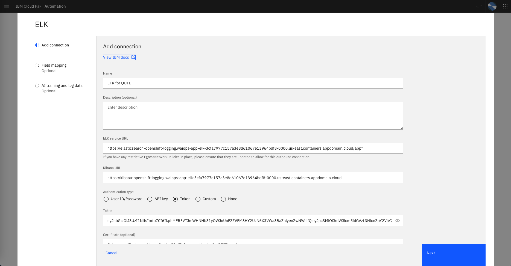
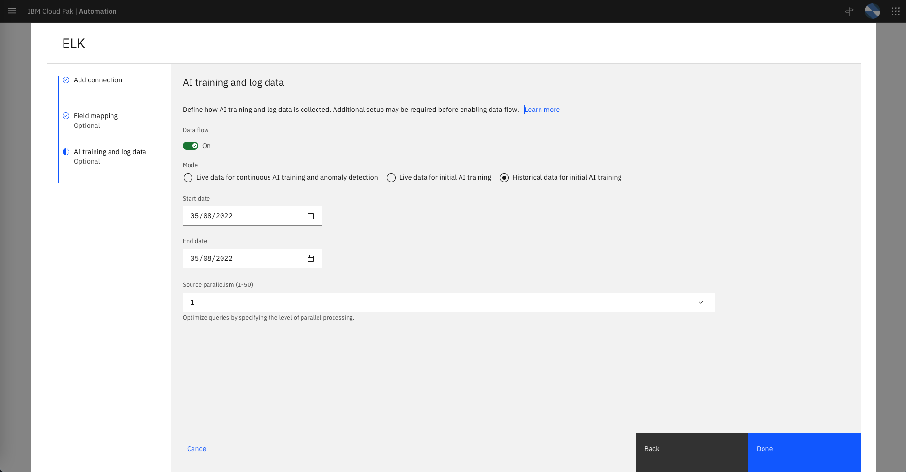
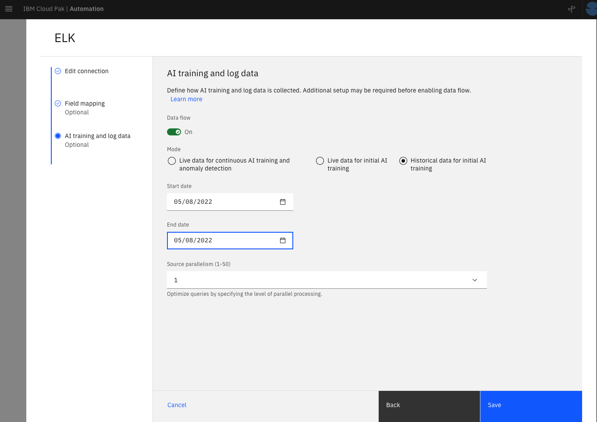
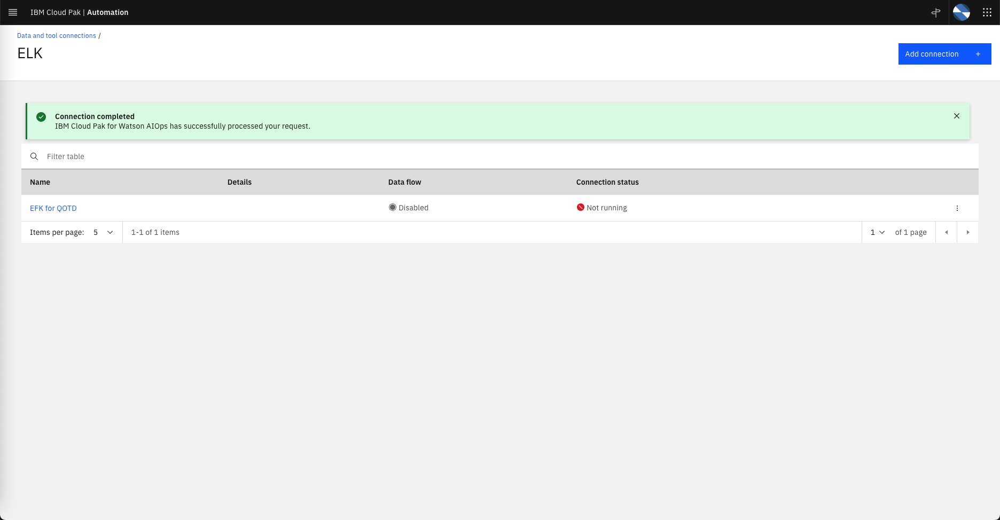
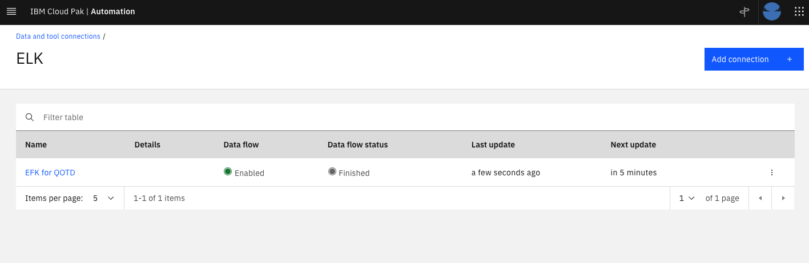
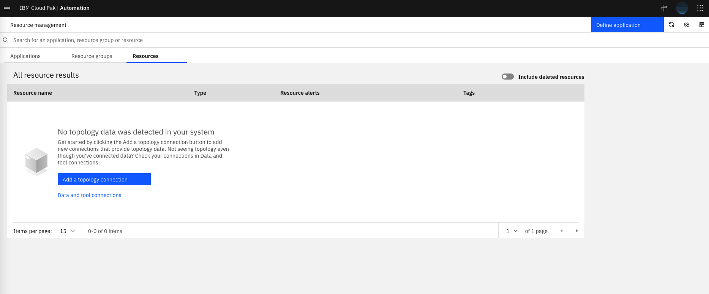
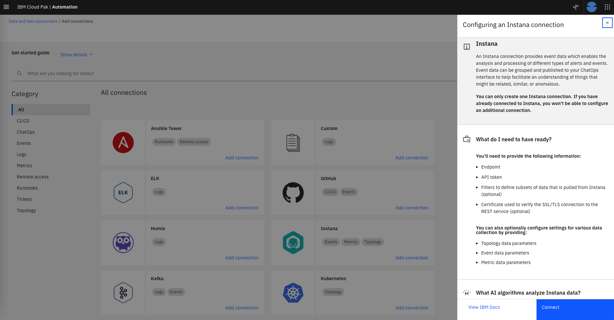
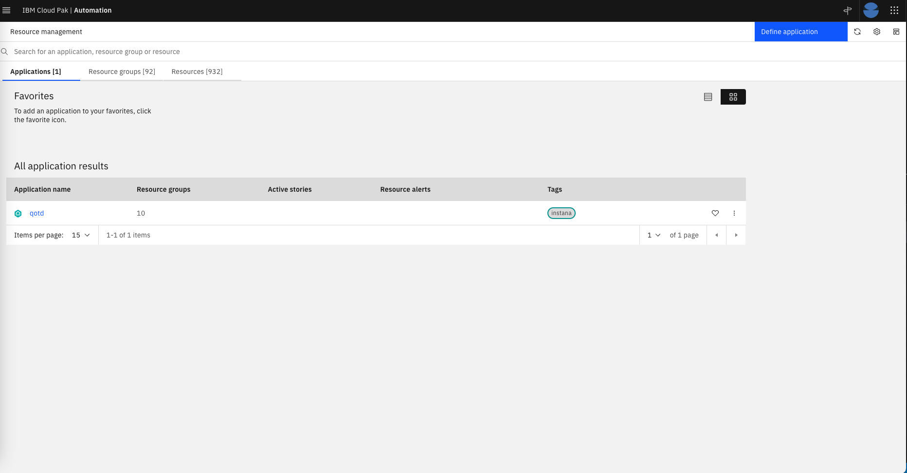
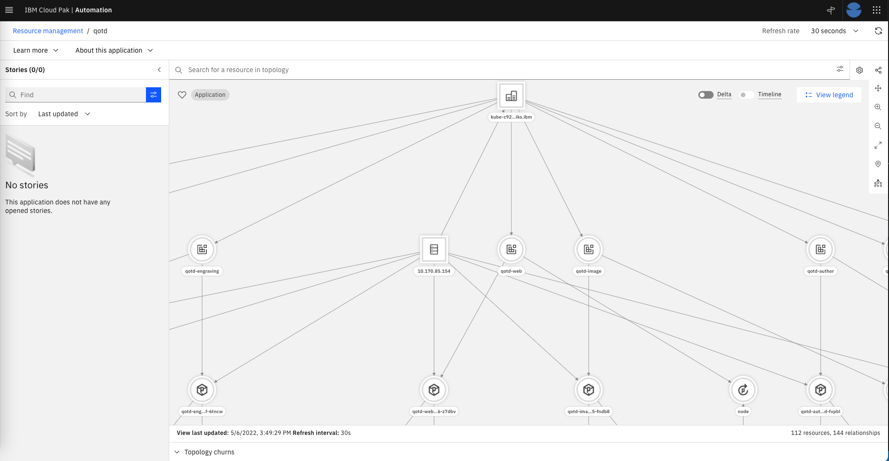

# Configuring Data Sources

## Connecting to the CP4WAIOps console

Lets start by connecting to the CP4WAIOps console. Use the URL and login credentials given by your Lab coordinator. You will see the console home page as shown below. 

* Note that the Lab environments use self signed certificates. During login the browser will ask you to accept the risk. You will get two prompts. 

* On the login page, do not select OpenShift authentication, select **IBM provided credentials (admin only)** instead.

* As you go to different new pages in the environment, you will see the *Page Tour* pop-up.  Feel free to follow them.


---

## Configure the EFK Integration

EFK is a variant of ELK (Elasticsearch, Logstash, and Kibana). EFK is a suite of tools combining Elasticsearch, Fluentd, and Kibana that functions as a log aggregation tool. Note that Kibana is a data visualization and exploration tool used for log and time-series analytics, application monitoring, and operational intelligence use cases. Now, to simplify the installation and configuration effort for installing the different components of the EFK stack on OpenShift, we leverage the `OpenShift Logging` library from OpenShift. OpenShift customers that prefer not to spend part of their budget on a commercial log aggregator such as Humio, Splunk, or LogDNA, more than likely use the `OpenShift Logging` library. 

To have AI Manager collect logs from the EFK installation that leverages the `OpenShift Logging` library, you need to define an EFK integration. The lab will provide the values that you should use for defining the EFK integration.

**Note that we will configure this connection but we will not save it as the training data has already been loaded to speed up the Lab.**

From the Home page, under `Overview` clik on `Data and tool connections` on the left side of the page. Click on the `Add connection` button on the top right. On the ELK card, select `Add connection`. Take a moment to read the connection overview on the right side slider, then click on `Connect`, as shown in the following screen.


Complete the ELK, `Add connection` form, with the following values:

* `Name`: Name of the ELK integration, for example `EFK for QOTD`.

* `Description`: Leave it blank.

* `ELK service URL`: Get the service URL for the EFK installation from the *Lab Parameters Table*.

* `Kibana URL`: Get URL for Kibana from the *Lab Parameters Table*.

* `Authentication type`: Set this value to `Token`.

* `Token`: Get the token from the *Lab Parameters Table*.

* `Certificate`: Leave it blank.

* `Filters`: Don't change it.

* `Time zone`: Select `GMT-4`.

* `Kibana port`: Type `443`.

* `Base parallelism`: Don't change it.

* `Sampling rate`: Don't change it.

Click on the `Next` button.

* `Field mapping`: Use the mapping shown below instead of the default mapping provided on the ELK integration. Make sure you see the `Valid JSON configuration` message after that:

```
{
    "codec": "elk",
    "message_field": "message",
    "log_entity_types": "kubernetes.container_image_id, kubernetes.host, kubernetes.pod_name, kubernetes.namespace_name",
    "instance_id_field": "kubernetes.container_name",
    "rolling_time": 10,
    "timestamp_field": "@timestamp"
}
```
* Click on the `Test Connection` button and confirm you get *Test Succeded* 

Click on the `Next` button.

* `Data flow`: Turn this on. 

* `Mode`: Select the `Historical data for initial AI training` option using the dates listed below. CP4WAIOps will ingest one day of historical application log data (stored in the log aggregator) that we know in advanced that can be used as a "reference" for a normal day because no major IT incident happen. We will use this data later for Log Anomaly training. 

    * Start date: May 8, 2022
    * End Date: May 8, 2022

* `Source parallelism (1-50)`: Don't change it.  

* Remember not to click on `Done`.

The following screenshots show the form update flow as guidance **(note that config values may be different in the screenshots, follow the previous instructions instead)**










Finally, click on `Cancel`.  

If you had saved the configuration, after some time, you will see the message `Connection completed. IBM Cloud Pak for Watson AIOps has successfully processed your request`.  Then if you click on the `ELK` Connection type the ELK integration page would show the `EFK for QOTD` integration you just defined showing the Data Flow Status as `Running` as shown below:



After some time, it would stop pulling data and the Data Flow Status would change to `Finished` as shown below.
 



---

## Configure the Instana Integration

The CP4WAIOps will consume topology information from Instana therefore we will configure this integration.

Lets verify first that there is no topology data in the system. From the navigator menu, go to the Home page again, clik on `Resource management` under `Overview` on the left side of the page. On the Resource management page, make sure there are no Applications, Resource groups nor Resources defined, as shown below
 


Now, lets define the Instana integration. From the Home page, clik on `Data and tool connections` under `Overview` on the left side of the page. Click on the `Add connection` button on the top right. On the Instana card, select `Add connection`. Take a moment to read the connection overview on the right side slider, then click on `Connect`, as shown in the following screen.



Enter the following `Add connection` information:

* `Name`: The display name of your connection, for example `Instana connection`.

* `Description`: An optional description for the connection. Leave it blank.

* `Endpoint`: Get the URL for the Instana Endpoint from the *Lab Parameters Table*.

* `API Token`: Get the API Token from the *Lab Parameters Table*.

* `Deployment options`: Select `local` (Note that it is possible to deploy an Instana conection gateway remotely, but in this lab we will deploy in the same `local` cluster).


Click Next.

Enter the following `Collect topology data`:

* `Enable data flow`: Set this toggle button to on (green).

* `Time window` (seconds): Leave as it is. This is the windowSize parameter within the Instana API.

* `Connection Intervals` (seconds): Leave as it is. This is how frequently to run the job to collect topology.

* `Application name allowlist pattern`: This allows to select from the set of applications that Instana is "observing" which one we will pull data from. In this Lab, we will pull topology data from a single application called qotd. Type in `qotd`.

* `Import Instana application perspectives as Cloud Pak for Watson AIOps applications`: Make sure this toggle button is set to `on` (green). This option will save us some time as we don't need to manually create in CP4WAIOps an application that group the topology resources that we pull from Instana. In CP4WAIOps, an application represents a group of resources put together.


Click Next.

Enter the following in `Collect event data`:

* `Enable data flow`: Slide this toggle button to off (grey). We will not collect event data in this Lab.

Click Next.

Enter the following in `Collect metric data`:

* `Enable data flow`: Slide this toggle button to off (grey). We will not collect metric data in this Lab.

Click Done. 

Now, lets verify that CP4WAIOps actually received topology data.

From the Home page, clik on Resource management under Overview on the left side of the page. On the Resource management page, you will see a new application defined called `qotd` as shown below:



Click on the application `qotd` and you will see the topology resources related to this application as shown in the picture below. Feel free to zoom-in to see details. Note that it will take 10-20 minutes to get a complete representation of all the topology entities and relationships.



---


## Review and Update CP4WAIOps Policies

Now, lets take a look at the automations page in CP4WAIOps. By creating automations, we can proactively set up actions and policies to detect and remediate events. 

From the Home page, clik on `Automations` under `Overview` on the left side of the page. In this page, we can manage *Policies*, *Runbooks* and *Actions*.

Under the *Policies* tab, we can see a list of system predefined policies that support a number of features in CP4WAIOps. We will review and enable a predefined policy that create stories:

* Click on the Tag pull down filter and select `Story` to only show the Story related policies.

* Change the state of the `Default story creation policy for all alerts` policy from Disabled to Enabled by clicking on the State slider. We need to enable this policy so we can see stories being created later in the Inference section of the Lab.

* This Policy will basically create a new Story for every new Alert regardless of the severity of the Alert. 

Click on the policy name to see the policy details on the right side of the page. 

* Click on the `Journal` tab to see the updates done so far to this policy.

* Click on the `Specification` tab to see the actual steps or logic of the policy.

That's all we need to do to enable this policy. 

---