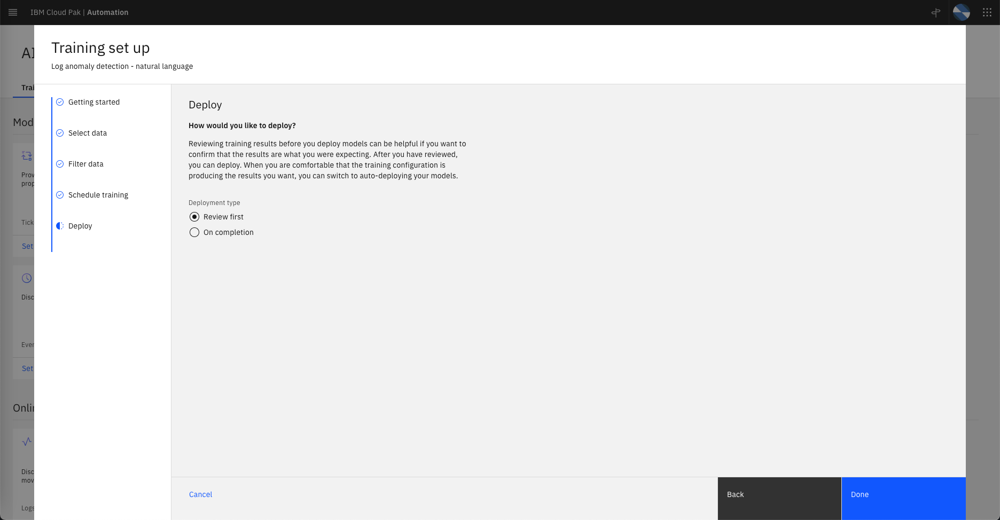
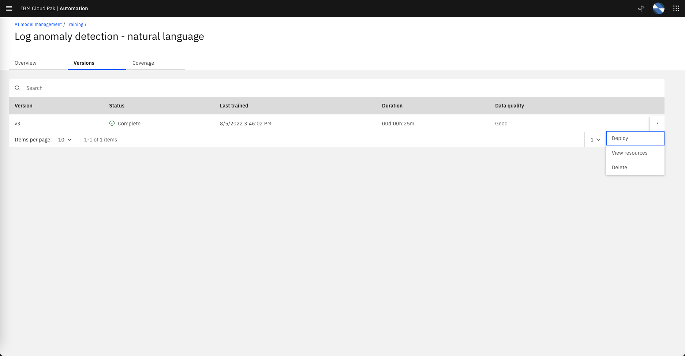
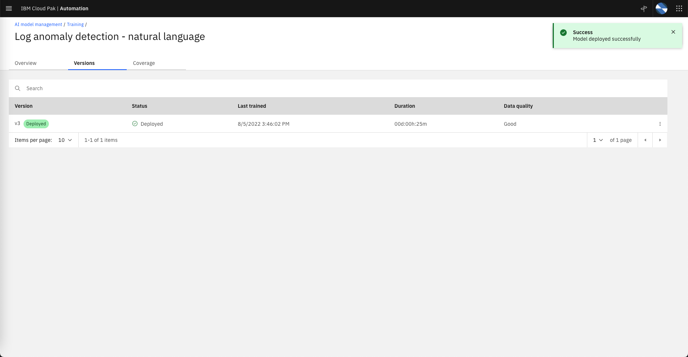
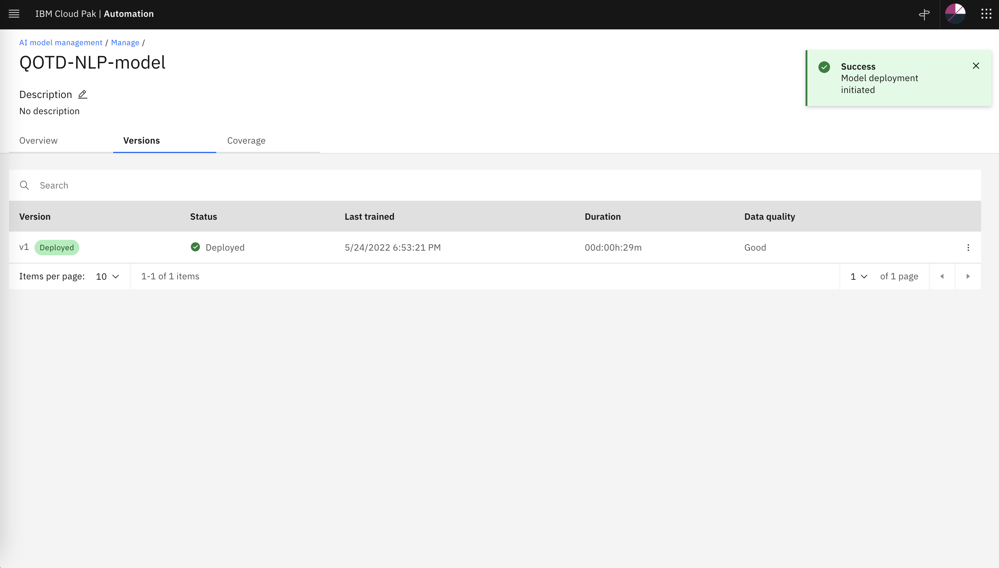

# Log Anomaly Training

## Recap

Lets recap what we have done so far:

* We have defined an integration to a Log Aggregator (EFK) that its receiving logs from an application called *qotd* and we have pulled logs into CP4WAIOps for a period of 1 day.

* We have defined an integration to Instana which is observing the environment where qotd is running and we have pulled every resource topology information related to this application into CP4WAIOps.

Now we will do log anomaly training to create a model that CP4WAIOps will use to find anomalies in the logs.

---

## Log Anomaly Algorithms

In CP4WAIOps v3.3, two log anomaly detection AI algorithms are available, each of which can run independently of the other. If both algorithms are enabled, then any log anomalies that are discovered by both algorithms are reconciled so that only one alert is generated. The severity of this combined alert is equal to the highest severity of the two alerts.

* **Statistical baseline log anomaly detection** extracts specific entities from the logs, such as short text strings that indicate error codes and exceptions. The algorithm combines the entities with other statistics, such as number of logs for each component, and uses the data as a baseline to discover abnormal behavior in your live log data.

* **Natural language log anomaly detection** uses natural language techniques on a subset of your log data to discover abnormal behavior.

Log anomaly detection takes large amounts of log data and trains on it to learn what is considered normal behavior for a particular component. This model goes beyond just looking at error states or frequency of metadata around log messages. Instead, it determines when something becomes an anomaly compared to what patterns it typically exhibits during normal times.

---

## Configuring Log Anomaly Training

* From the Home page, under `Overview` click on `AI model management` to open the AI Model Management dashboard (feel free to skip the *Tour* pop-up window).

* On the `AI algorithms` tab, on the `Log anomaly detection-natural language` tile, click `Configure`.

   

* **Getting started:** Under Data and tool connections, check that at least one connection is listed down the page.

   

Click `Next` to move to the next pane.

* **Provide details:** Here we provide a name and description to identify this algorithm configuration later. Lets leave the default Configuration name. 

   

Click `Next` to move to the next pane.

* **Select data:** Specify a date range to train upon. Select `Custom` and specify Date1 as Start Date and Date2 as End Date.

   

Click `Next` to move to the next pane.

* **Filter data:** Here we have the option to filter out known anomalies in the training data by specifing date ranges to skip. In this Lab, we don't need to specify any date range to get filtered. 

   

Click `Next` to move to the next pane.

* **Schedule training:** Here we can specify a time schedule to run the training if needed. In this Lab we will run the training manually therefore make sure that *Run on a schedule* is set to `Off` (grey).

   

Click `Next` to move to the next pane.

* **Deploy:** To review the results of training before deploying the model, ensure that Deployment type is set to `Review first`.

   

Click `Done` to save the algorithm configuration.

Now you will notice that the `Log anomaly detection-natural language` tile, is set to `Configured`.

   

Now that the Log Anomaly configuration is set, we can start the training.

---

## Start Training

* From the AI model management page, click on the `Manage` tab to open the management section.

    

* Click the algorithm configuration that you just defined to generate an AI model. The overview page is displayed.

   

* In the right sidebar, click `Start training`.

* After a few moments, the following response is displayed: `Training successfully started`.

* The AI Training tile displays the message: `Data retrieving. Training is now in progress.`

     

* Once the training is complete, the AI Training tile displays the message: `Training complete`. At this point, AI models are created, with a specified data quality.

   

* To deploy the model, click the algorithm configuration for whose model that you want to deploy. The overview page is displayed.

   In the right sidebar, click `Deploy vX`, where X is the version number of the model that is generated, but not deployed.

   

* Once the model is deployed, you can check the status of the model under the `Versions` tab.

   

---

